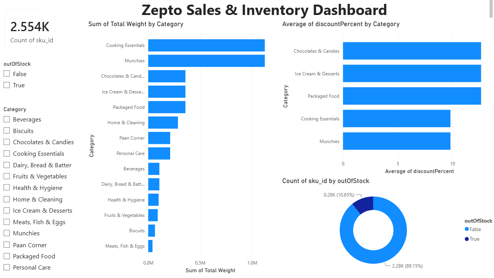
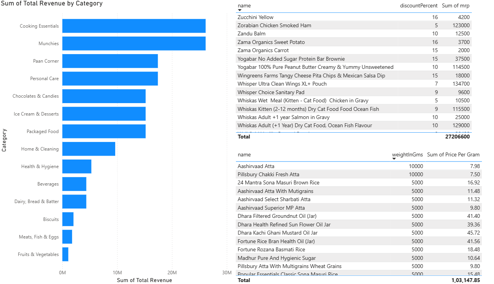

# Zepto Sales & Inventory Dashboard

A data analysis and visualization project using **SQL** and **Power BI**, built on Zepto's product dataset.

## Project Overview
This project explores Zepto's product inventory and sales data to uncover insights on pricing, discounts, stock availability, and category-wise performance.

## Tools Used
- **SQL** – Data cleaning, exploration, and analysis
- **Power BI** – Interactive dashboard and visualizations

## Dataset
- `zepto_v3.csv` – Raw product data (category, MRP, discount, stock status, weight, etc.)
- `sql_project.sql` – SQL scripts for data cleaning and analysis queries

## Data Cleaning (SQL)
- Removed rows with zero MRP / selling price
- Converted prices from paise to rupees
- Checked for null values and duplicate product names

## Key Analysis Questions
1. Top 10 best-value products by discount percentage
2. High MRP products that are out of stock
3. Estimated revenue per category
4. Products with MRP > ₹500 and discount < 10%
5. Top 5 categories by average discount
6. Price per gram for products above 100g
7. Weight categorization (Low / Medium / Bulk)
8. Total inventory weight per category

## Dashboard Preview

### Page 1 — Overview
Total product count, stock status breakdown, total weight by category, and average discount by category.

### Page 2 — Revenue & Product Details
Revenue by category, top discount products, and price-per-gram comparison.

## Key Insights
- **Cooking Essentials** and **Munchies** lead in both total revenue and total inventory weight.
- About **89%** of products are currently in stock, **11%** out of stock.
- **Chocolates & Candies**, **Ice Cream & Desserts**, and **Packaged Food** offer the highest average discounts (~10-13%).
- A total of **2,554** unique products were analyzed after data cleaning.
- Products like **Whisper Ultra Clean Wings XL+ Pouch** and **Whiskas Adult (+1 Year) Dry Cat Food, Ocean Fish Flavour** have high MRPs (₹1,000+) among top-discount items.
- Best price-per-gram value products include **Pillsbury Chakki Fresh Atta** (₹7.50) and **Aashirvaad Atta** (₹7.98) for large 5-10kg packs.

## Files in this Repo
- `sql_project.sql` — SQL queries for cleaning and analysis
- `zepto_v3.csv` — Dataset
- `Zepto_Dashboard.pbix` — Power BI dashboard file
- `images/` — Dashboard screenshots
